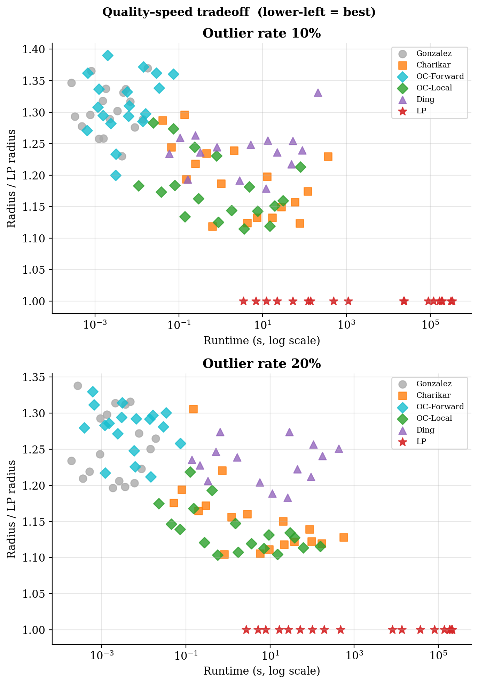
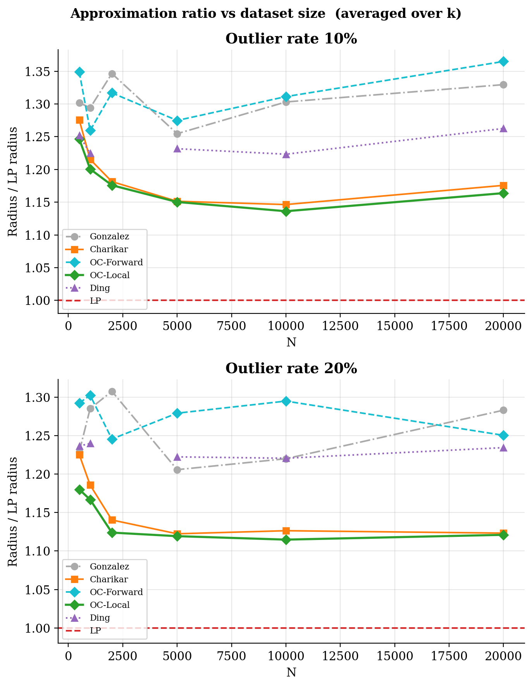
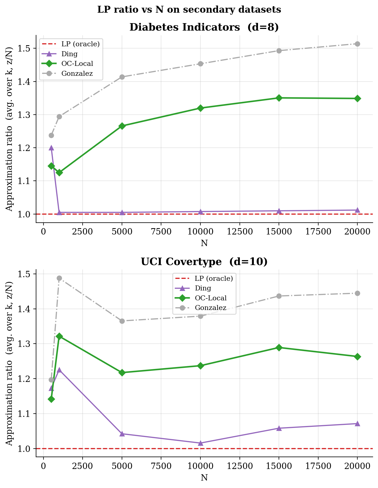
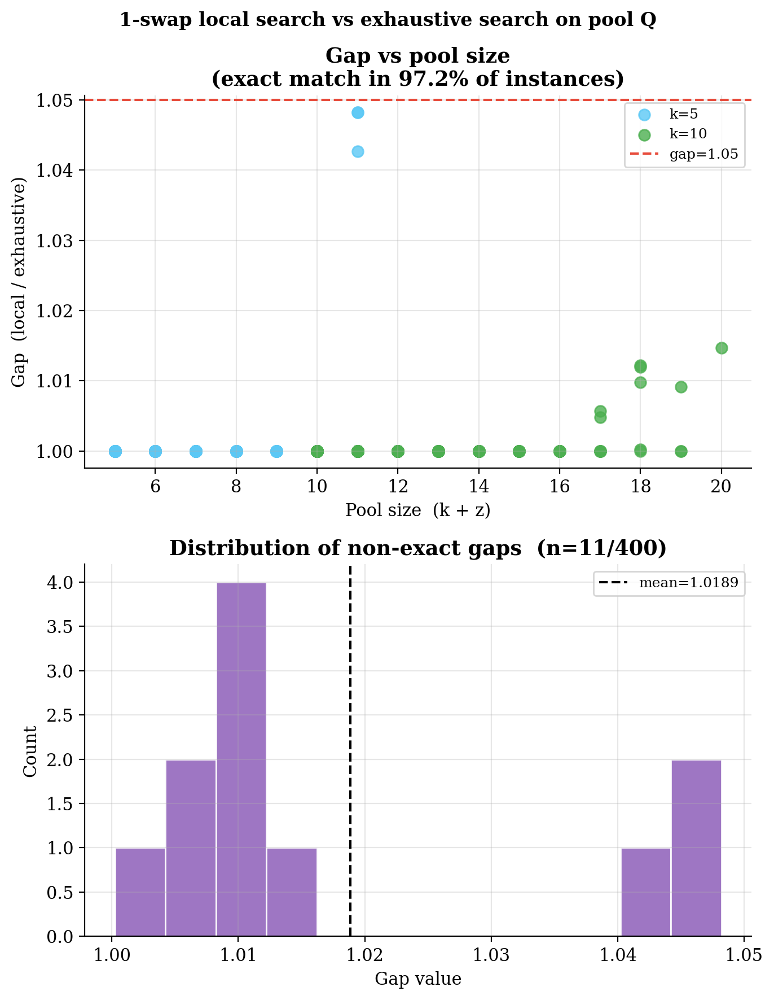
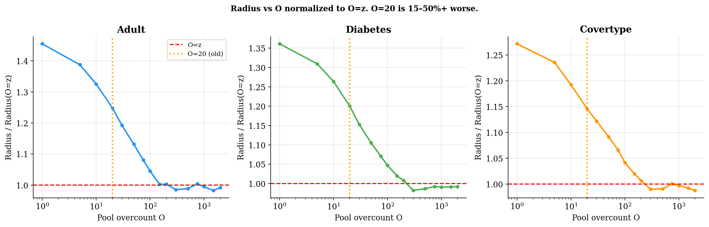
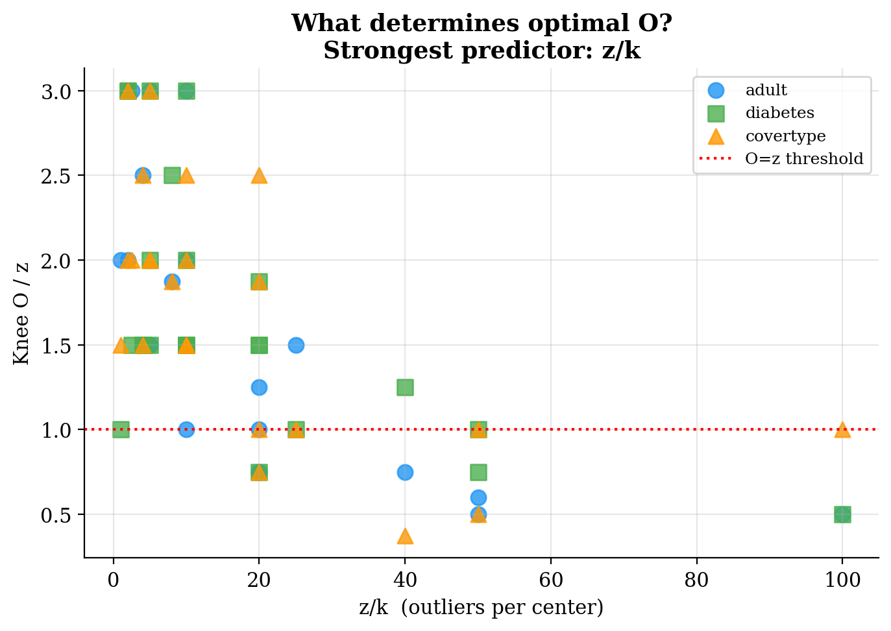

# OverclusterDRG: Code and Experiments

This repository contains the implementation and experimental suite for the paper **"OverclusterDRG: A Practical Algorithm for Robust k-Center Clustering with Outliers"**. The tools provided allow for the complete replication of all results discussed in the paper.

This implementation validates an algorithm that is not only theoretically grounded but also highly practical — achieving LP approximation ratios close to 1.0 while running orders of magnitude faster than competing approaches.

---

## 1. Summary of Key Empirical Findings

Experiments across three UCI datasets (Adult, Diabetes, Covertype) establish the following:

1. **Best solution quality among practical algorithms.** OC-Local (OverclusterDRG) achieves mean LP ratios of **1.147 (Adult), 1.155 (Diabetes), and 1.171 (Covertype)** — the lowest of any practical algorithm tested. On every single configuration, OC-Local strictly occupies the lower-left frontier of the quality–runtime tradeoff.

<p align="center">
  
  &nbsp;&nbsp;
  
</p>

2. **Faster than all competitors.** OC-Local beats Charikar in 33/36 Adult configurations at a median **7× speedup**, and beats Ding et al. in 35/36 at a median **8× speedup**. Both comparisons are significant at p < 10⁻⁵. Performance holds on larger secondary datasets where Charikar becomes intractable.

<p align="center">
  
</p>

3. **The 1-swap local search step always helps and rarely misses the optimum.** Compared to an exhaustive search over all C(k+z, k) subsets of the pool, the 1-swap local search finds the exact pool optimum in **97.2% of 400 small instances**. In the remaining cases the gap never exceeds 4.82%, and the mean gap is 1.89%.

<p align="center">
  
</p>

4. **Exact phase transition at pool size O = z.** The algorithm's quality degrades sharply when the pool overcount O < z, and flattens once O reaches z — a theoretically proven threshold, not a tuning choice. The O/z ratio is tightly predicted by z/k (r = −0.60).

<p align="center">
  
  &nbsp;&nbsp;
  
</p>

---

## 2. Guide to Reproducing Results

### Step 1: Setup

```bash
pip install numpy scipy pandas matplotlib gurobipy
```

Gurobi with a valid licence is required for the LP lower bound. All other results run without it.

### Step 2: Run Experiments

```bash
# All algorithms on Adult dataset
python code/run_all_algorithms.py adult

# Ding et al. on all three datasets
python code/run_ding.py

# OC-Local on Diabetes and Covertype
python code/run_oclocal.py

# Pool-size ablation sweep
python code/explore2.py

# Local search vs exhaustive comparison
python code/exhaustive.py
```

Results are written to `results/` as CSV files.

### Step 3: Generate Plots

```bash
python code/generate_paper_figures.py
python code/experiments/run_plots.py
```

Plots are written to `plots/`. Pre-computed results are already included so this step can be run immediately.

---

## 3. Algorithm and Code Description

### Code Structure

| File | Purpose |
|------|---------|
| `code/drg.py` | Core algorithm: `gonzalez_pool`, `forward_greedy`, `local_search`, `oc_greedy`, `oc_local` |
| `code/gonzalez.py` | RKC-Gonzalez baseline |
| `code/rkc.py` | Charikar 3-approximation |
| `code/LP_relaxed.py` | LP lower bound via Gurobi |
| `code/run_all_algorithms.py` | Benchmark runner for all algorithms |
| `code/run_ding.py` | Ding et al. randomized greedy baseline |
| `code/run_oclocal.py` | OC-Local on secondary datasets |
| `code/exhaustive.py` | Exhaustive phase-2 search for quality verification |
| `code/explore2.py` | Pool-size ablation sweep |
| `code/generate_paper_figures.py` | Main paper figures |
| `code/experiments/run_plots.py` | Ablation and phase-transition figures |

### OC-Greedy and OC-Local (`code/drg.py`)

**Phase 1 — Pool construction:** Run the Gonzalez farthest-point algorithm for k + z steps starting from the point nearest the empirical centroid. This produces a pool Q of k + z candidate centers guaranteed to contain a 3·OPT solution.

**Phase 2a — Forward greedy (OC-Greedy):** Greedily select k centers from Q by minimising the robust radius r_z at each step, where r_z is the (z+1)-th largest distance from any point to its nearest chosen center.

**Phase 2b — Local search (OC-Local):** Apply 1-swap first-improvement local search over the pool until no single swap of a selected center for an unselected one lowers r_z.

### Charikar 3-approximation (`code/rkc.py`)

Binary search over all pairwise distances. For each candidate radius r, a greedy feasibility oracle assigns points with coverage radius r and discards those within deletion radius 3r.

### LP Lower Bound (`code/LP_relaxed.py`)

Binary search over all pairwise distances. For each candidate radius r, tests feasibility of the standard LP relaxation with fractional center variables y_i, assignment variables x_ij, and outlier coverage constraint sum x_ij ≥ N − z. Solved via Gurobi. The smallest feasible radius R_LP satisfies R_LP ≤ OPT.

### Ding et al. (`code/run_ding.py`)

Randomized greedy: at each of k steps, sample uniformly at random from the z + 1 farthest points from all current centers. Run T = ⌈(z+1)·ln(100)⌉ independent trials and return the best solution.

---

## 4. Datasets

The experiments use three publicly available datasets from the [UCI Machine Learning Repository](https://archive.ics.uci.edu/).

1. **UCI Adult (Census Income)** — [Link](https://archive.ics.uci.edu/ml/datasets/adult) — 6 continuous features (age, education, capital gain/loss, hours per week). Subsampled to N ∈ {500 … 20,000}.

2. **Diabetes Health Indicators** — [Link](https://www.kaggle.com/datasets/alexteboul/diabetes-health-indicators-dataset) — 21 binary/integer health survey features.

3. **Covertype** — [Link](https://archive.ics.uci.edu/ml/datasets/covertype) — 10 continuous cartographic features, 581,012 rows subsampled to N ∈ {500 … 15,000}.

All features are z-score standardised. Distances are Euclidean. Datasets are provided as Python list-of-lists files in `datasets/`.
